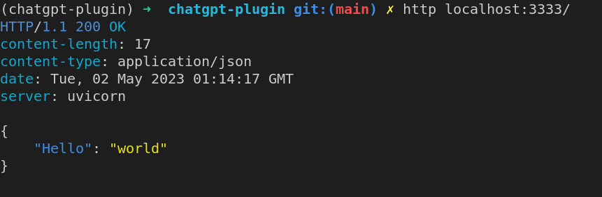
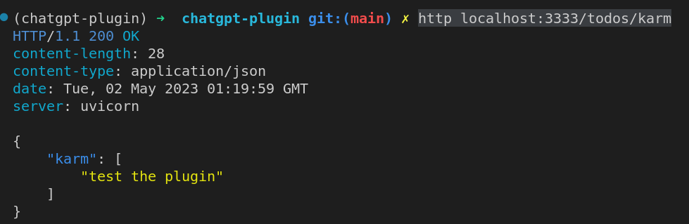
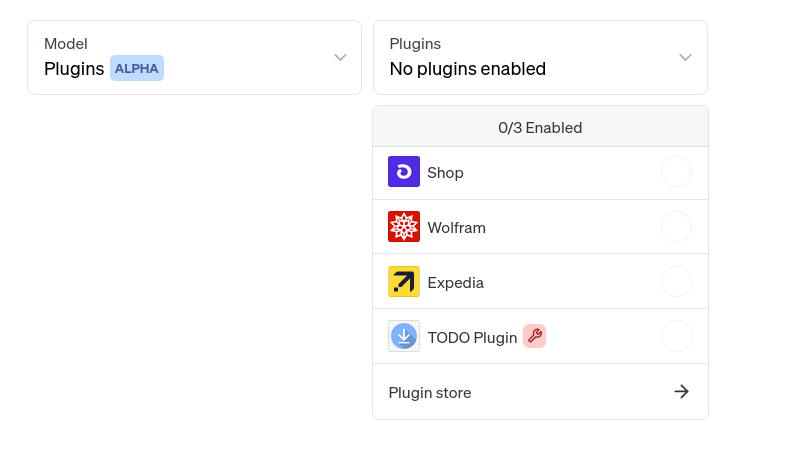
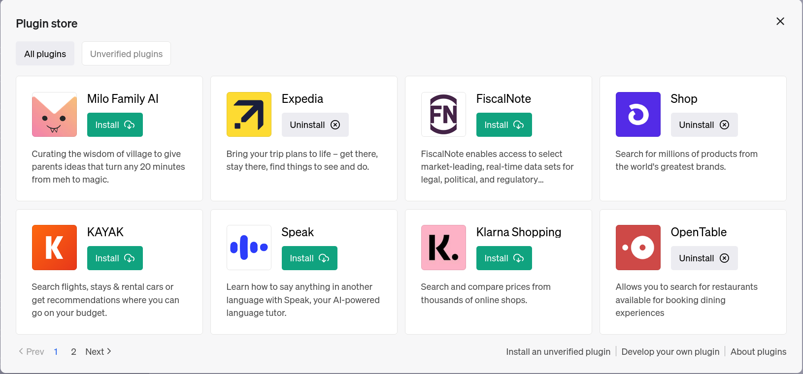
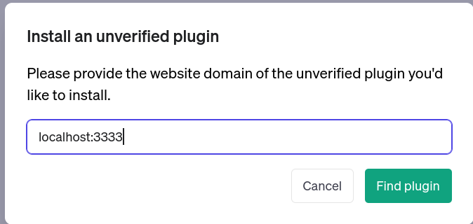

# Quickstart
1. Clone the repo
1. (optional create a venv)
```python
python -m venv <env_name>
source <env_name>/bin/activate~
```
1. install the requirements `pip install -r requirements.txt`
1. run the server `uvicorn app:app --reload --port 3333`
1. Note for Safari Users - The plugin might not work unless you disable CORS blocking, see [this stackoverflow](https://stackoverflow.com/questions/4556429/disabling-same-origin-policy-in-safari) for instructions on how to do this. It's currently been confirmed to work with firefox and chrome. 
# Creating your chatgpt plugin

Creating a custom chatgpt plugin is pretty straightforward, it consists of 3 main bits - 
1. Creating the API
1. Creating a Manifest JSON
1. Documenting the api via an OpenAPI/Swagger yaml file.

## Creating the API
This can be built in pretty much anyway you like, In python libraries like Flask, FastAPI and Quart are really popular, they all work mostly similarly and are largely interchangeable for the purpose of this document.
For this tutorial, we're going to use FastAPI.
Detailed FastAPI documentation can be found [here](https://fastapi.tiangolo.com/)
1. Create your virtual environment and install fastapi
```bash
python -m venv <env_name>
source <env_name>/bin/activate
pip install fastapi "uvicorn[standard]"
```
we're going to recreate the OpenAI example TODO app with fastapi. Create a python file and add the following lines to it. The filename isn't important, I called it app.py
<h5 a><strong><code>app.py</code></strong></h5>

``` python
from fastapi import FastAPI
from fastapi.middleware.cors import CORSMiddleware

app = FastAPI()

app.add_middleware(
    CORSMiddleware,
    allow_origins=["https://chat.openai.com"],
    allow_credentials=True,
    allow_methods=["*"],
    allow_headers=["*"],
)
```
the first line just declares a FastAPI app, the second line tells the server to allow CORS requests from [chat.openai.com](chat.openai.com). This essentially means your server won't reject requests coming from chatGPT that originate from your browser. More detail on CORS can be found [here](https://developer.mozilla.org/en-US/docs/Glossary/CORS)

beyond this you want to add all of your functionality to this file and use appropriate python decorators to each function to declare an endpoint.
for example
```python
@app.get("/")
async def hello_world():
    return {"Hello": "world"}
```
this declares that a GET request to the site root will return a JSON object that has "Hello" as a key and "world" as a value. 
The OpenAI tutorial has a couple of endpoints, first there's an endpoint that allows a user to create a TODO item in their list on sending a POST request. 
The Fastapi equivalent of the same is
```python
class Todo(BaseModel):
    todo: str | None = None

@app.post("/todos/{username}", status_code=200)
def add_todo(username: str, todo: Todo | None = None):
    if username not in _TODOS:
        _TODOS[username] = []
    _TODOS[username].append(todo.todo)
    return {"todo": todo.todo, "user": username}
```
Here we're using `{username}` as a path parameter so sending the post request to /todos/foo will create a todo item for the user foo. Secondly, we're using pydantic to declare that the post request will carry a JSON as a body parameter and that object will have a field called todo which will be a string. Fastapi uses python type hints to handle the datatype conversion for you.

There's a few more endpoints, but they're more of the same thing, so if you need a reference for those, check out the full file [here](app.py)

An important note, we have 2 endpoints that exposed not for app functionality, but to declare that functionality to chatGPT namely
```python
@app.get("/.well-known/ai-plugin.json", response_class=Response, status_code=200)
async def plugin_manifest():
    with open("ai-plugin.json") as f:
        response = f.read()
    return Response(content=response, media_type="text/json")

@app.get("/openapi.yaml", response_class=Response, status_code=200)
async def openapi_spec(request: Request):
    host = request.client.host
    scheme = request.url.scheme
    port = request.url.port
    print(host)
    with open("openapi.yaml") as f:
        text = f.read()
    return Response(content=text, media_type="text/yaml")
```
these endpoints return a manifest that you need when you register your plugin with the chatGPT interface, and the api spec in OpenAPI format in a yaml. I'll provide some detail about these in a minute, but for now, we can start a server to host our api locally via the command `uvicorn <filename>:<appname> --port <portnumber>` or in my case `uvicorn app:app --reload --port 3333` the reload parameter just auto-restarts the server if it crashes for some reason.

## Plugin Manifest.json
The plugin manifest is a required part of creating the chatGPT plugin - chatgpt will always look at `<domain>/.well-known/ai-plugin.json` for the manifest file. If you host the api on a remote server, this has to be https, for localhost http is fine. 
a minimal version of the plugin is 
<h5><strong><code>ai-plugin.json</code></strong></h5>

```json
{
    "schema_version": "v1",
    "name_for_human": "TODO Plugin",
    "name_for_model": "todo",
    "description_for_human": "Plugin for managing a TODO list. You can add, remove and view your TODOs.",
    "description_for_model": "Plugin for managing a TODO list. You can add, remove and view your TODOs.",
    "auth": {
        "type": "none"
    },
    "api": {
        "type": "openapi",
        "url": "http://localhost:3333/openapi.yaml",
        "is_user_authenticated": false
    },
    "logo_url": "http://localhost:3333/logo.png",
    "contact_email": "support@example.com",
    "legal_info_url": "http://www.example.com/legal"
}
```
which is just taken from the openai documentation, essentially you're required to declare the api documentation format, the url at which you can find the spec and whether your api requires authentication or not. More information on the schema can be found [here](https://platform.openai.com/docs/plugins/getting-started/plugin-manifest). The description_for_model field is really important as chatgpt looks at it as an input to the user's utterance so you would want to tune it/experiment with it like you would a text prompt for using chatgpt regularly. 

## API Spec YAML
The last component before we can use our plugin is the yaml file which defines the API spec in Swagger/OpenAPI. 
This is essentially documentation for your endpoints, again the descriptions for each endpoint are looked at by the model when it's deciding which endpoints to hit. Writing this spec is a little bit tedious, however, FastAPI will automatically generate most of the fields for you, once you have your api built, you can run your server, and visit [/openapi.json](http://localhost:3333/openapi.json) to download a json version of the spec that you can then use any [online tool](https://www.json2yaml.com/) to convert the json to a yaml and then editing the description fields. If there are any endpoints that you don't want chatGPT to use, remove them from this spec and it won't send requests to them. 

An example for our app is 
```
openapi: 3.0.1
info:
  title: TODO Plugin
  description: A plugin that allows the user to create and manage a TODO list using ChatGPT. If you do not know the user's username, ask them first before making queries to the plugin. Otherwise, use the username "global".
  version: 'v1'
servers:
  - url: PLUGIN_HOSTNAME
paths:
  /todos/{username}:
    get:
      operationId: getTodos
      summary: Get the list of todos
      parameters:
      - in: path
        name: username
        schema:
            type: string
        required: true
        description: The name of the user.
      responses:
        "200":
          description: OK
          content:
            application/json:
              schema:
                $ref: '#/components/schemas/getTodosResponse'
    post:
      operationId: addTodo
      summary: Add a todo to the list
      parameters:
      - in: path
        name: username
        schema:
            type: string
        required: true
        description: The name of the user.
      requestBody:
        required: true
        content:
          application/json:
            schema:
              $ref: '#/components/schemas/addTodoRequest'
      responses:
        "200":
          description: OK
    delete:
      operationId: deleteTodo
      summary: Delete a todo from the list
      parameters:
      - in: path
        name: username
        schema:
            type: string
        required: true
        description: The name of the user.
      requestBody:
        required: true
        content:
          application/json:
            schema:
              $ref: '#/components/schemas/deleteTodoRequest'
      responses:
        "200":
          description: OK

components:
  schemas:
    getTodosResponse:
      type: object
      properties:
        todos:
          type: array
          items:
            type: string
          description: The list of todos.
    addTodoRequest:
      type: object
      required:
      - todo
      properties:
        todo:
          type: string
          description: The todo to add to the list.
          required: true
    deleteTodoRequest:
      type: object
      required:
      - todo_idx
      properties:
        todo_idx:
          type: integer
          description: The index of the todo to delete.
          required: true
```
## Local Testing
To locally test the API that we've built I recommend [HTTPie](https://httpie.io/cli) which can also be installed via pip `pip install httpie`

Once you have HTTPie installed, you want to run the server using `uvicorn app:app --port 3333` and then from a seperate terminal instance, send http requests to various endpoints you've defined using HTTPie. For example, `http localhost:3333/` will send a GET request to the root path(/) and you should get a JSON with key "Hello" and value "world"



Similarly, `http POST localhost:3333/todos/karm todo="test the plugin"` will send a post request to the TODO creation endpoint with a json data object and subsequently, `http localhost:3333/todos/karm` should return a list of todos with the user karm, that should have the todo "test the plugin".




## Setting up the plugin

Finally once you're all set up, you log into the chatgpt ui, in the interface , scroll down the list of plugins until you see "plugin store", click "develop your own plugin" and point it to your server url, in my case it was `localhost:3333`






